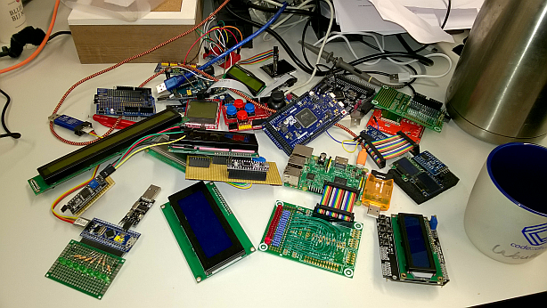

HwCpp NRF24L01 interface

&nbsp;

&nbsp;

<!-- update example_path( "../include/chips" ) -->

<!--
TO DO list
-->

<!-- update example_path( "../include/chips/" ) -->

*****************************************************************************

# 1 Introduction

HwCpp is a library for close-to-the-hardware programming.
It can be found at www.github.com/wovo/hwcpp.

This document describes the HwCpp NRF24L01 library

*****************************************************************************

# 2 Content

<!-- update table_of_contents( input, 3 ) -->

  - [1 Introduction](#toc-anchor-0)

  - [2 Content](#toc-anchor-1)

  - [3 The NRF24L01](#toc-anchor-2)

    - [3.1 General](#toc-anchor-3)

    - [3.2 Configuration](#toc-anchor-4)

    - [3.3 CTO](#toc-anchor-5)

    - [3.4 Low-level interface](#toc-anchor-6)

<!-- update end -->

&nbsp;

*****************************************************************************

# 3 The NRF24L01

## 3.1 General

The NRF24L01 is a popular 433 MHz transceiver 
(combined transmitter and receiver) chip. 
It typically used in short-range low-cost low-datarate applications like
wireless PC peripherals, doorbells, and weather stations.
Modules that combine the chip with the crystal, a PCB antenna and
some passive components can be bought very cheap from Chinese websites.
According to many websites these cheap modules contain some lower-quality
clone instead of the real chip.

## 3.2 Configuration

The chip operates in one of 128 frequency bands within the 433 MHz range.
The air data rate can be 1 MHz or 2 MHz. 
The higher rate offers faster transmission, the lower rate offers a little
more distance.
Distance and power consumption are (also) influenced by the 
transmit power setting (4 levels) and the LNA (receiver) gain setting 
(2 levels). 
A CRC can be used. When used, it can be 1 or 2 bytes long.
Addresses of up to 1..5 bytes are used to identify the 
intended receiver of a message.
The address length is configurable.
These settings are generally the same for all NRF24 devices that
communicate.

The receiver part of the chip listens to up to 6 channels.
The channels 0 and 1 have separate addresses of (up to 5) bytes.
The channels 2..5 use the channel 1 address but with a different
lowest byte.

Each channel can be configured for fixed length messages (32 bytes)
or varying length messages (1..32 bytes), for datagram (unacknowledged)
or acknowledged (with timeout and retries). 
When acknowledges are used (on at least one channel) CRC use is 
automatically enabled.

The chip uses a SPI interface and a separate CE line that is used
to power-down the chip.

After startup, the chip must be configured in accordance with the
other chip(s) it must communicate with.

## 3.3 CTO

The chip interface is a static class template that must be
instantiated by the user to create a cto.
All subsequent interface elements are defined within this 
cto.
The ::init() function must be called before any other
functions are called.

<!-- update quote( input, "hwcpp-nrf24l01.hpp", "##cto" ) -->
~~~C++
template<
   typename bus,         // the SPI bus
   can_pin_out  _ce,     // the CE (Chip Enable) pin
   can_pin_out  _csn,    // the SPI Chip Select (Negative) pin
   is_waiting   timing   // the timing service
>
struct nrf24l01_spi_ce_csn {
~~~

## 3.4 Low-level interface

Over the SPI bus, commands can be sent, and (using the
read and write commands) registers can be read or written.
The set of commands is defined by an enumerate.

<!-- update quote( input, "hwcpp-nrf24l01.hpp", "##commands" ) -->
~~~C++
   enum class cmd : uint8_t {
      read_reg           = 0x00, // read a register
      write_reg          = 0x20, // write a register
      r_rx_payload       = 0x61, // read a received payload
      w_tx_payload       = 0xa0, // write a payload to be sent
      flush_tx           = 0xe1, // empty the transmit queue
      flush_rx           = 0xe2, // empty the receive queue
      reuse_tx_pl        = 0xe3, // start continuous retransmission
      activate           = 0x50, // toggle register bank or extended functions
      r_rx_pl_wid        = 0x60, // read length of fifo top payload
      w_ack_payload      = 0xa8, // write payload to be transmitted with ack
      w_tx_payload_noack = 0xb0, // write payload to be sent without auto-ack
      nop                = 0xff  // can be used to read the status
   };
~~~

The command functions issues a command, 
with and optional single data byte (for the activate command) 
or array of bytes (for the w_ack_payload or w_tx_payload_noack commands).
The functions return the chip status byte.

<!-- update quote( input, "hwcpp-nrf24l01.hpp", "##command" ) -->
~~~C++
~~~~

Another enumerate defines the set of registers.

<!-- update quote( input, "hwcpp-nrf24l01.hpp", "##registers" ) -->
~~~C++
   enum class reg : uint8_t {
      config             = 0x00, // configuration register
      en_aa              = 0x01, // enable auto ack on pipes
      en_rxaddr          = 0x02, // enable receive pipes
      setup_aw           = 0x03, // set address length
      setup_retr         = 0x04, // retransmission settings
      rf_ch              = 0x05, // rf channel (frequency)
      rf_setup           = 0x06, // data rate, transmit power, lna
      status             = 0x07, // status register
      observe_tx         = 0x08, // lost and retransmitted packets
      cd                 = 0x09, // carrier detect
      rx_addr_p0         = 0x0a, // receive address pipe 0, 5 bytes
      rx_addr_p1         = 0x0b, // receive address pipe 1, 5 bytes
      rx_addr_p2         = 0x0c, // receive address pipe 2, 1 byte
      rx_addr_p3         = 0x0d, // receive address pipe 2, 1 byte
      rx_addr_p4         = 0x0e, // receive address pipe 2, 1 byte
      rx_addr_p5         = 0x0f, // receive address pipe 2, 1 byte
      tx_addr            = 0x10, // tranmsit adress, 5 bytes
      rx_pw_p0           = 0x11, // number of bytes in pipe 0 package
      rx_pw_p1           = 0x12, // number of bytes in pipe 1 package
      rx_pw_p2           = 0x13, // number of bytes in pipe 2 package
      rx_pw_p3           = 0x14, // number of bytes in pipe 3 package
      rx_pw_p4           = 0x15, // number of bytes in pipe 4 package
      rx_pw_p5           = 0x16, // number of bytes in pipe 5 package
      fifo_status        = 0x17, // receive and transmit fifo status (RO)
      dynpd              = 0x1c, // dynamic payload flags
      feature            = 0x1d  // special features flags
   };
~~~

Read and write functions are provided that ac

